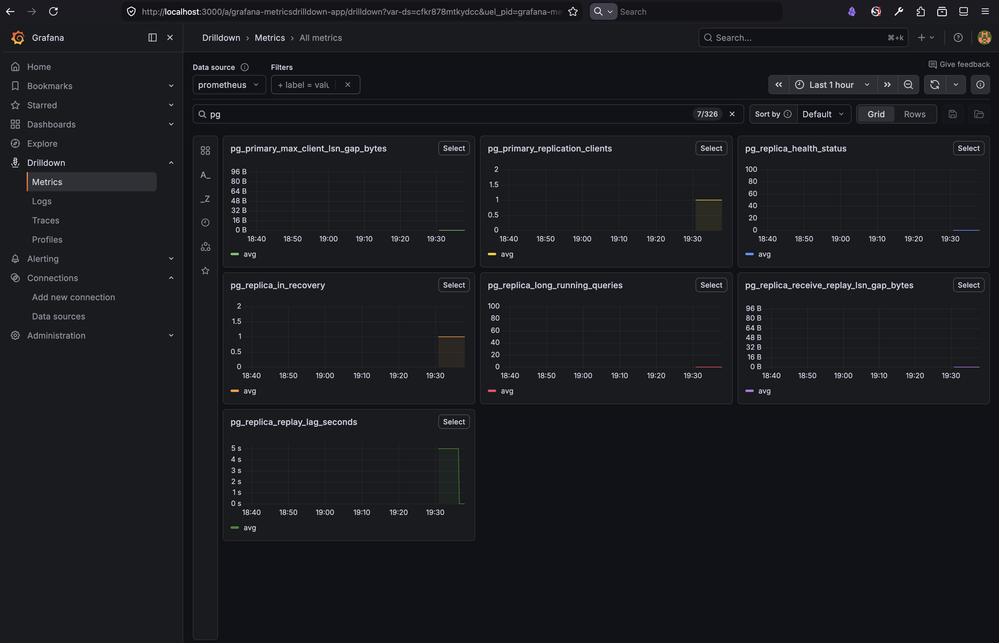

# PgPulse
A Rust service/CLI that monitors your primary and read replica.


## Local setup 
For local environment, spin up the postgres docker containers and Grafana environment including Prometheus via `docker-compose.yml`
```bash
docker-compose up -d
```


## Configuration
Update the file `config.yaml` file with the connection details of your primary and read replica.


## Run the service
Pass the config file as the cli argument: 
```bash
cargo run -- --config config.yaml
```

## Demo Dashboard


## References:
 - [What to Look for if Your PostgreSQL Replication is Lagging](https://severalnines.com/blog/what-look-if-your-postgresql-replication-lagging/)
 - [Practical PostgreSQL Logical Replication: Setting Up an Experimentation Environment Using Docker](https://dev.to/ietxaniz/practical-postgresql-logical-replication-setting-up-an-experimentation-environment-using-docker-4h50)
- [Monitoring a Rust Web Application Using Prometheus and Grafana](https://medium.com/better-programming/monitoring-a-rust-web-application-using-prometheus-and-grafana-3c75d9435dec)
- [Rust Updates 2025 E4: LazyCell and LazyLock Deep Dive](https://medium.com/@md.abir1203/rust-updates-2025-e4-lazycell-and-lazylock-deep-dive-5622f3bac38e)
