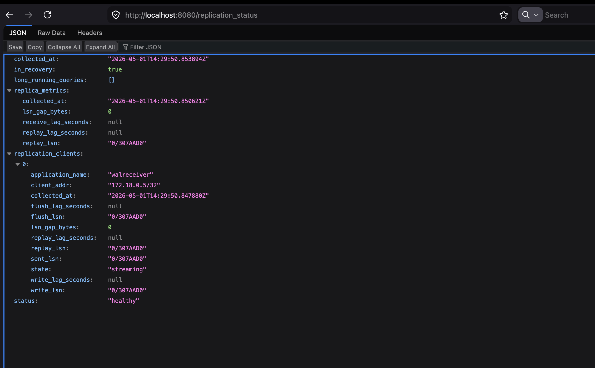
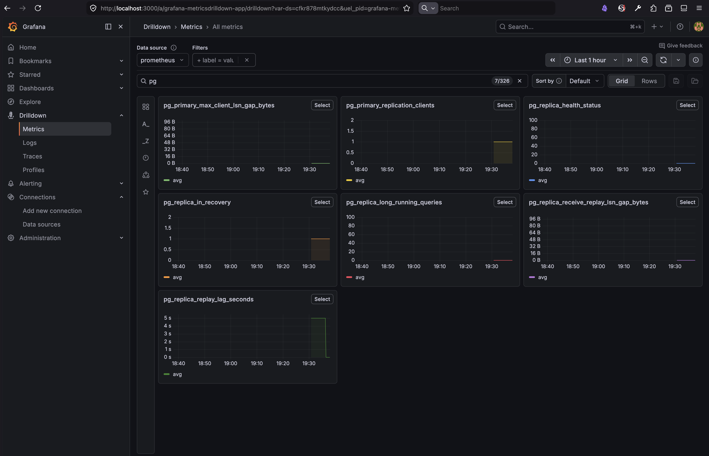

# PgPulse
A Rust service/CLI that monitors your primary and read replica.


## Local setup 
For local environment, spin up the postgres docker containers and Grafana environment including Prometheus via `docker-compose.yml`
```bash
docker-compose up -d
```

If you just want to run the grafana and prometheus, then you can use the following command:
```bash
docker-compose -f docker-compose-grafana.yml up -d
```


## Configuration
Update the file `config.yaml` file with the connection details of your primary and read replica.


## Run the service
Pass the config file as the cli argument: 
```bash
cargo run -- --config config.yaml
```

*Note*: If you are are not using the Local setup via docker-compose, then expose the endpoint `http://localhost:8080/metrics` as a data source in Grafana to visualize the replication lag and other metrics. (It is already added in the `prometheus.yml` file for local setup)


## Building and installing the pgpulse extension natively

These steps build and install the `pgpulse` PostgreSQL extension directly on a machine running PostgreSQL 18, without Docker.

### Prerequisites

- PostgreSQL 18 server installed and running (`postgresql-18` + `postgresql-server-dev-18`)
- Rust toolchain (`rustup`/`cargo`)
- `libclang-dev`, `clang`, `pkg-config`, `libssl-dev`

On Debian/Ubuntu (PGDG repo required for pg18):

```bash
# Add the PGDG apt repository
curl -fsSL https://www.postgresql.org/media/keys/ACCC4CF8.asc \
    | gpg --dearmor -o /usr/share/keyrings/postgresql.gpg
echo "deb [signed-by=/usr/share/keyrings/postgresql.gpg] \
https://apt.postgresql.org/pub/repos/apt $(lsb_release -cs)-pgdg main" \
    > /etc/apt/sources.list.d/pgdg.list
apt-get update
apt-get install -y postgresql-18 postgresql-server-dev-18 \
    libclang-dev clang pkg-config libssl-dev
```

### 1. Install cargo-pgrx (exact version)

```bash
cargo install cargo-pgrx --version "=0.18.0" --locked
```

### 2. Initialise pgrx against the system PostgreSQL

```bash
cargo pgrx init --pg18 /usr/lib/postgresql/18/bin/pg_config
```

This tells pgrx where the system `pg_config` is so it doesn't download its own PostgreSQL copy.

### 3. Build the extension package

```bash
cargo pgrx package \
    --features pg18 \
    --pg-config /usr/lib/postgresql/18/bin/pg_config \
    -p pgpulse
```

Artifacts are placed under `target/release/pgpulse-pg18/` mirroring the system layout:

```
target/release/pgpulse-pg18/
  usr/lib/postgresql/18/lib/pgpulse.so
  usr/share/postgresql/18/extension/pgpulse.control
  usr/share/postgresql/18/extension/pgpulse--0.1.0.sql
```

### 4. Install the artifacts

```bash
cp target/release/pgpulse-pg18/usr/lib/postgresql/18/lib/pgpulse.so \
    /usr/lib/postgresql/18/lib/

cp target/release/pgpulse-pg18/usr/share/postgresql/18/extension/pgpulse.control \
   target/release/pgpulse-pg18/usr/share/postgresql/18/extension/pgpulse--0.1.0.sql \
    /usr/share/postgresql/18/extension/
```

### 5. Configure PostgreSQL to load the extension

Add to `postgresql.conf`:

```ini
shared_preload_libraries = 'pgpulse'

# Optional — configure the replica connection for lag monitoring
pgpulse.replica_host     = '192.168.1.20'
pgpulse.replica_port     = 5432
pgpulse.replica_user     = 'pgpulse'
pgpulse.replica_password = 'pgpulse'
pgpulse.replica_dbname   = 'postgres'
```

Then restart PostgreSQL to pick up `shared_preload_libraries`:

```bash
systemctl restart postgresql@18-main
# or: pg_ctlcluster 18 main restart
```

### 6. Create the extension

Connect to the target database and run:

```sql
CREATE EXTENSION pgpulse;
```

Verify the background worker is running and collecting metrics:

```sql
SELECT pgpulse_collected_at(), pgpulse_health_status();
-- collected_at should be non-zero after ~10 seconds (one poll cycle)
```


## Running the exporter on a non-Docker server

These steps produce a standalone binary and run it on any Linux machine that has a PostgreSQL 18 cluster with the `pgpulse` extension already loaded.

### 1. Install the Rust toolchain (if not present)

```bash
curl --proto '=https' --tlsv1.2 -sSf https://sh.rustup.rs | sh
source "$HOME/.cargo/env"
```

### 2. Build the release binary

```bash
cargo build --release -p pgpulse-exporter
```

The binary is at `target/release/pgpulse-exporter`. Copy it to the target server:

```bash
scp target/release/pgpulse-exporter user@your-server:/usr/local/bin/pgpulse-exporter
```

### 3. Create a config file on the server

```bash
cat > /etc/pgpulse/config.yaml <<'EOF'
primary:
  host: 127.0.0.1   # address of your PostgreSQL primary
  port: 5432
  name: postgres    # database where CREATE EXTENSION pgpulse was run
  user: pgpulse
  password: pgpulse
  ssl_enabled: false

server:
  host: "0.0.0.0"
  port: 8080
EOF
```

### 4. Run the binary

```bash
pgpulse-exporter --config /etc/pgpulse/config.yaml
```

Verify it is working:

```bash
curl http://localhost:8080/health
curl http://localhost:8080/metrics
```


## Testing the exporter binary

Use this when you want to run the `pgpulse-exporter` binary directly on your machine (or a remote server) while keeping the PostgreSQL stack in Docker, or pointing at a standalone PostgreSQL instance.

### Prerequisites

- Rust toolchain (`rustup`, `cargo`) installed on the host machine
- The Docker stack (or any accessible PostgreSQL 18 server with the `pgpulse` extension loaded) reachable from the host

### 1. Start only the PostgreSQL containers (skip the exporter)

The Docker stack already exposes the primary on `localhost:5432`. Start the database containers so the extension is running:

```bash
docker compose up -d master_db replica_db
```

Wait until the primary is healthy:
```bash
docker compose ps          # master_db should show "(healthy)"
```

### 2. Build the exporter binary

```bash
cargo build --release -p pgpulse-exporter
# binary lands at: target/release/pgpulse-exporter
```

### 3. Create a config file pointing at the local/remote PostgreSQL

The default `config.yaml` already targets `localhost:5432`, so you can use it as-is when the Docker stack is running:

```yaml
primary:
  host: localhost       # or the remote IP / hostname
  port: 5432            # 5432 = master_db; use 5433 for replica_db
  name: pgpulse
  user: pgpulse
  password: pgpulse
  ssl_enabled: false

server:
  host: "0.0.0.0"
  port: 8080
```

Save it as `config.local.yaml` to keep it separate from the Docker config:

```bash
cp config.yaml config.local.yaml
# edit config.local.yaml if your PostgreSQL uses different credentials or host
```

### 4. Run the binary

```bash
./target/release/pgpulse-exporter --config config.local.yaml
```

You should see:
```
INFO pgpulse_exporter: Starting pgpulse-exporter...
INFO pgpulse_exporter: Config loaded!
INFO pgpulse_exporter: pgpulse-exporter listening on 0.0.0.0:8080
```

### 5. Verify the endpoints

In a separate terminal, hit each endpoint with `curl`:

```bash
# Health check
curl http://localhost:8080/health
# Expected: {"status":"ok","message":"PgPulse is running"}

# Replication status (JSON)
curl http://localhost:8080/replication-status
# Expected: {"replication_status":[{"replica_name":"walreceiver","replay_lag_seconds":...}]}

# Prometheus metrics
curl http://localhost:8080/metrics
# Expected: lines like:
# pgpulse_replication_lag_seconds{replica_name="walreceiver"} 0.5
# pgpulse_lsn_gap_bytes{replica_name="walreceiver"} 0
# pgpulse_health_status{node="primary"} 0
```

### Troubleshooting

| Error | Likely cause | Fix |
|---|---|---|
| `connection refused` on port 5432 | Docker containers not started | `docker compose up -d master_db replica_db` |
| `error: authentication failed` | Wrong credentials in config | Confirm user/password match `POSTGRES_USER`/`POSTGRES_PASSWORD` in `docker-compose.yml` |
| `error: relation "pgpulse.replication_status" does not exist` | Extension not installed in the target DB | Connect with `psql` and run `CREATE EXTENSION pgpulse;` |
| `pgpulse_collected_at` returns 0 | BGW not started yet | Wait 10–15 seconds (one poll cycle) and retry |
| Binary crashes on startup | Wrong pgrx/Rust version | Run `rustup update stable` and rebuild |


## Demo

### Metrics Endpoint


### Grafana Dashboard


## References:
 - [What to Look for if Your PostgreSQL Replication is Lagging](https://severalnines.com/blog/what-look-if-your-postgresql-replication-lagging/)
 - [Practical PostgreSQL Logical Replication: Setting Up an Experimentation Environment Using Docker](https://dev.to/ietxaniz/practical-postgresql-logical-replication-setting-up-an-experimentation-environment-using-docker-4h50)
- [Monitoring a Rust Web Application Using Prometheus and Grafana](https://medium.com/better-programming/monitoring-a-rust-web-application-using-prometheus-and-grafana-3c75d9435dec)
- [Rust Updates 2025 E4: LazyCell and LazyLock Deep Dive](https://medium.com/@md.abir1203/rust-updates-2025-e4-lazycell-and-lazylock-deep-dive-5622f3bac38e)
- [How to Build PostgreSQL Custom Background Workers](https://oneuptime.com/blog/post/2026-01-30-postgresql-background-workers/view) - The best blog I went through so far about how postgreSQL extension work internally, its using C for examples, but the concepts are the same for Rust as well.
